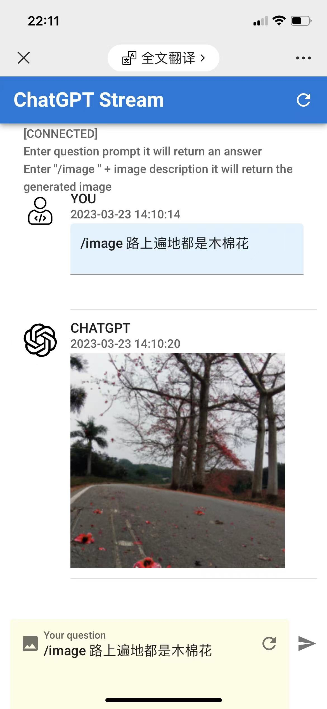

# 实时ChatGPT服务，支持GPT3/GPT4，支持对话和通过句子生成图片

- [English README](README.md)
- [中文 README](README_CN.md)

## chatGPT-service和chatGPT-stream

- chatGPT-service: [https://github.com/cookeem/chatgpt-service](https://github.com/cookeem/chatgpt-service) 
  - chatGPT-service是一个后端服务，用于实时接收chatGPT的消息，并通过websocket的方式实时反馈给chatGPT-stream
- chatGPT-stream: [https://github.com/cookeem/chatgpt-stream](https://github.com/cookeem/chatgpt-stream) 
  - chatGPT-stream是一个前端服务，以websocket的方式实时接收chatGPT-service返回的消息

## gitee传送门

- [https://gitee.com/cookeem/chatgpt-service](https://gitee.com/cookeem/chatgpt-service) 
- [https://gitee.com/cookeem/chatgpt-stream](https://gitee.com/cookeem/chatgpt-stream) 

## 效果图

- 实时对话模式


- 通过句子生成图片模式



## 快速开始

```bash
# 拉取代码
git clone https://github.com/cookeem/chatgpt-service.git
cd chatgpt-service

# chatGPT的注册页面: https://beta.openai.com/signup
# chatGPT的注册教程: https://www.cnblogs.com/damugua/p/16969508.html
# chatGPT的APIkey管理界面: https://beta.openai.com/account/api-keys

# 修改config.yaml配置文件，修改apiKey，改为你的openai.com的apiKey
vi config.yaml
# openai的apiKey，改为你的apiKey
apiKey: "xxxxxx"

# 创建生成的图片目录
mkdir -p assets
chown -R 1000:1000 assets

# 使用docker-compose启动服务
docker-compose up -d

# 查看服务状态
docker-compose ps   
     Name                    Command               State                  Ports                
-----------------------------------------------------------------------------------------------
chatgpt-service   /chatgpt-service/chatgpt-s ...   Up      0.0.0.0:59142->9000/tcp             
chatgpt-stream    /docker-entrypoint.sh ngin ...   Up      0.0.0.0:3000->80/tcp,:::3000->80/tcp


# 访问页面，请保证你的服务器可以访问chatGPT的api接口
# http://localhost:3000
```

- 直接输入问题，则调用ChatGPT接口返回答案
- `/image `后边输入想要的图片描述，则调用DALL-E2接口，通过图片描述自动生成图片

## 如何编译

```bash
# 拉取构建依赖
go mod tidy
# 项目编译
go build

# 执行程序
./chatgpt-service

# 相关接口
# ws://localhost:9000/api/ws/chat

# 安装wscat
npm install -g wscat

# 使用wscat测试websocket，然后输入你要查询的问题
wscat --connect ws://localhost:9000/api/ws/chat

```